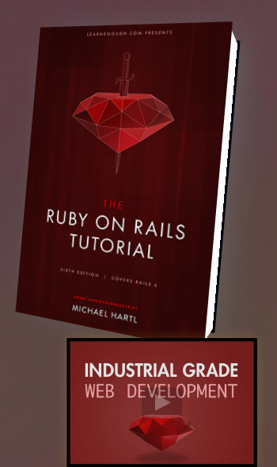

### Ruby on Rails Tutorial

## "Toy_app"

- This is the second application for the
[*Ruby on Rails Tutorial*](https://www.railstutorial.org/)
by [Michael Hartl](https://www.michaelhartl.com/). Toy_app!

## Getting Started

- This app is functional micropost blog with possibility to create, edit, update and delete users and their microposts (micro in this case means it must contain less then 140 symbols in it). App is connected to database accordingly.

## Live Demo

[Live Demo Link](https://rocky-anchorage-36714.herokuapp.com/)

## On your Computer

To get a local copy up and running follow these simple example steps.

## Prerequisites

- Any PC or device with an internet connection and ability to use the command
  line terminal

## Setup

- Open the command line terminal

## Install

- Go to your preferred directory
- Run `git clone https://github.com/Igors78/Toy_app.git` command
- Install Rails with all dependencies in order to run local server and app in it:
`install Rails`
`bundle install`

## Usage

- Go to respective directory and run
`rails server`
- Open LOCALHOST:3000 in your browser

## Built with

- Ruby 2.7.0
- Ruby on Rails 6.0.3.4

## Author

👤 **Igors Oleinikovs**

- GitHub: [@githubhandle](https://github.com/Igors78)
- Twitter: [@twitterhandle](https://twitter.com/oleinikovs)
- LinkedIn: [LinkedIn](https://www.linkedin.com/in/igors-oleinikovs-17a10958/)

## 🤝 Contributing

Contributions, issues, and feature requests are welcome!

## Show your support

Give a ⭐️ if you like this project!

## Acknowledgments

- Ruby documentation
- [Ruby Guides](https://www.rubyguides.com/)
- [Michael Hartl](https://www.michaelhartl.com/)

## 📝 License

This project is [UNLicense](./LICENSE) licensed.
